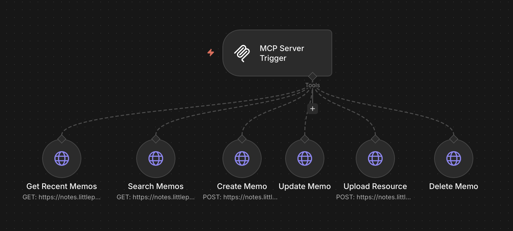
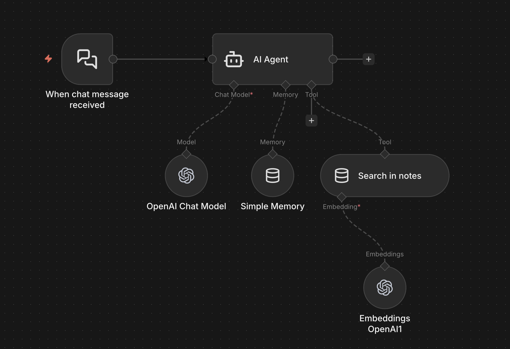
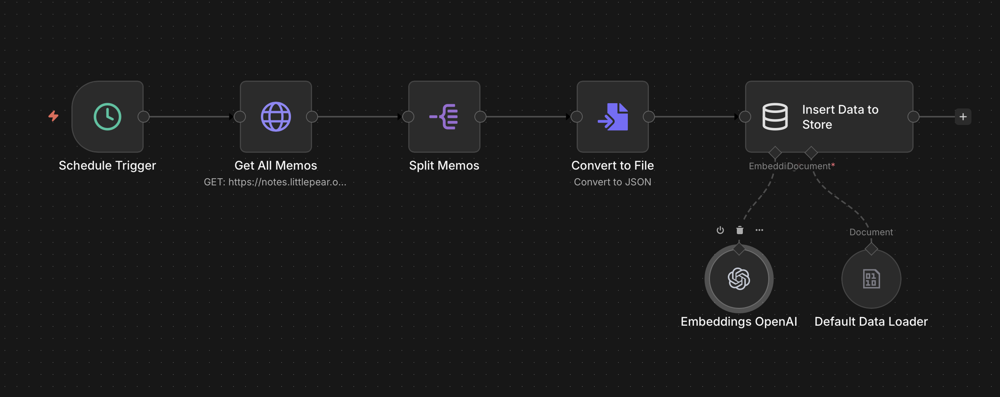

# Memos + n8n Integration

Complete integration between [Memos](https://www.usememos.com/) (self-hosted notes app) and [n8n](https://n8n.io/) that enables AI-powered note management through MCP server, vector search, and automated synchronization.

## What This Integration Provides

This integration consists of three complementary workflows:

1. **MCP Server** - Exposes Memos API as MCP tools for AI assistants
2. **Vector Search Agent** - AI agent with semantic search across all notes (example))
3. **Vector Store Sync** - Automated workflow that keeps vector database updated

## Features

### MCP Server Capabilities
- 📝 **Create** new memos with tags and visibility settings
- 🔍 **Search** memos by content, tags, and visibility
- ✏️ **Update** existing memos
- 🗑️ **Delete** memos
- 📎 **Upload** resources (images, files)
- 📋 **Get** recent memos

### Vector Search
- Semantic search across all your notes using OpenAI embeddings
- Natural language queries through AI chat interface
- Automatic synchronization with your notes database

## Prerequisites

- n8n instance (self-hosted or cloud)
- Memos instance with API access
- OpenAI API key (for vector embeddings and chat)
- Memos API token

## 🚀 Quick Start

### 1. Get Your Memos API Token

1. Open your Memos instance
2. Go to **Settings** → **Access Tokens**
3. Create a new access token
4. Copy the token for later use

### 2. Import Workflows

Import the three workflow files from the `workflows` folder:

- `Memos MCP.json` - MCP server
- `Memos vector search tool.json` - Search agent
- `Notes vector store schedule update.json` - Sync workflow

**To import:**
1. In n8n, go to **Workflows** → **Add workflow** → **Import from File**
2. Select each JSON file and import

### 3. Configure Credentials

#### Memos API Token (HTTP Header Auth)
1. Go to **Credentials** → **Add credential** → **HTTP Header Auth**
2. Name: `Memos API Token`
3. Name: `Authorization`
4. Value: `Bearer YOUR_MEMOS_API_TOKEN`

#### OpenAI API
1. Go to **Credentials** → **Add credential** → **OpenAI API**
2. Add your OpenAI API key

### 4. Update API Endpoints

In each workflow, update the Memos API URL to point to your instance:
- Replace `https://notes.YOUR_DOMAIN.org` with your Memos URL
- This needs to be updated in all HTTP Request nodes

### 5. Activate Workflows

1. **Notes vector store schedule update** - Activate this first to populate the vector database
2. Wait for the first sync to complete (runs hourly by default)
3. **Memos vector search tool** - Activate after vector store is populated
4. **Memos MCP** - Activate to enable MCP server

## Workflow Details

### 1. MCP Server (`Memos MCP.json`)

Creates an MCP server that exposes Memos API as tools for AI assistants like Claude.

**Available Tools:**
- `Get Recent Memos` - Fetch the 10 most recent notes
- `Search Memos` - Search by content, tags, or visibility
- `Create Memo` - Create new notes with tags
- `Update Memo` - Modify existing notes
- `Upload Resource` - Upload files from URL
- `Delete Memo` - Remove notes (with confirmation)

**MCP Connection:**
1. After activating the workflow, copy the MCP server URL
2. Add to your AI assistant's MCP configuration
3. Use Bearer token authentication (configure in MCP Server Trigger node)

### 2. Vector Search Agent (`Memos vector search tool.json`)

Example of AI-powered chat interface with semantic search through your notes using vector embeddings tool.

**Features:**
- Natural language search across all notes
- Finds notes by meaning, not just keywords
- Chat interface with conversation memory

**Usage:**
Open the chat interface and ask questions like:
- "Find notes about machine learning"
- "Show me ideas related to productivity"
- "What did I write about travel plans?"

### 3. Vector Store Sync (`Notes vector store schedule update.json`)

Automated workflow that synchronizes all Memos notes into an in-memory vector database.

**How it works:**
1. Runs on schedule (default: daily at 1 AM)
2. Fetches all memos from Memos API (up to 1000)
3. Converts each note to embeddings using OpenAI
4. Stores in n8n's in-memory vector store with key `vector_store_key`
5. Clears and rebuilds the entire store on each run

**Note:** The vector store uses n8n's built-in in-memory storage, shared across workflows via the memory key.

## Configuration Options

### Sync Schedule
By default, the vector store updates daily. To change:
1. Open `Notes vector store schedule update` workflow
2. Edit **Schedule Trigger** node
3. Adjust the interval (e.g., every 6 hours, daily)

### Vector Search Results
To change the number of results returned:
1. Open `Memos vector search tool` workflow
2. Edit **Search in notes** node
3. Change `Limit` parameter (default: 5)

### Page Size
To fetch more/fewer memos:
1. Edit the `pageSize` query parameter in HTTP Request nodes
2. In sync workflow, default is 1000 (max for most Memos instances)

## Additional Resources

- **Memos API Documentation**: [Memos API Reference](https://www.usememos.com/docs/api)
- **n8n Vector Store**: [Vector Store Documentation](https://docs.n8n.io/integrations/builtin/cluster-nodes/root-nodes/n8n-nodes-langchain.vectorstoreinmemory/)
- **MCP Protocol**: [Model Context Protocol](https://modelcontextprotocol.io/)

## Troubleshooting

### Vector Search Returns No Results
- Ensure the sync workflow has run at least once
- Check that the memory key `vector_store_key` matches in both workflows
- Verify OpenAI credentials are configured correctly

### MCP Server Not Responding
- Verify the workflow is active
- Check Bearer token authentication is configured
- Ensure the MCP Server Trigger node has the correct credentials

### API Errors
- Verify your Memos API token is valid
- Check that the API URL is correct and accessible
- Ensure your Memos instance is running

## 📝 Notes

- The vector store is **in-memory only** - it will be cleared on n8n restart
- Sync workflow rebuilds the entire vector store on each run for data consistency
- MCP server requires Bearer token authentication for security
- All workflows use the same Memos API credentials

## 🤝 Contributing

Found an issue or have a suggestion? Feel free to open an issue or submit a pull request!

## 📄 License

MIT License - feel free to use and modify as needed.

---

Made with ❤️ using n8n and Memos
